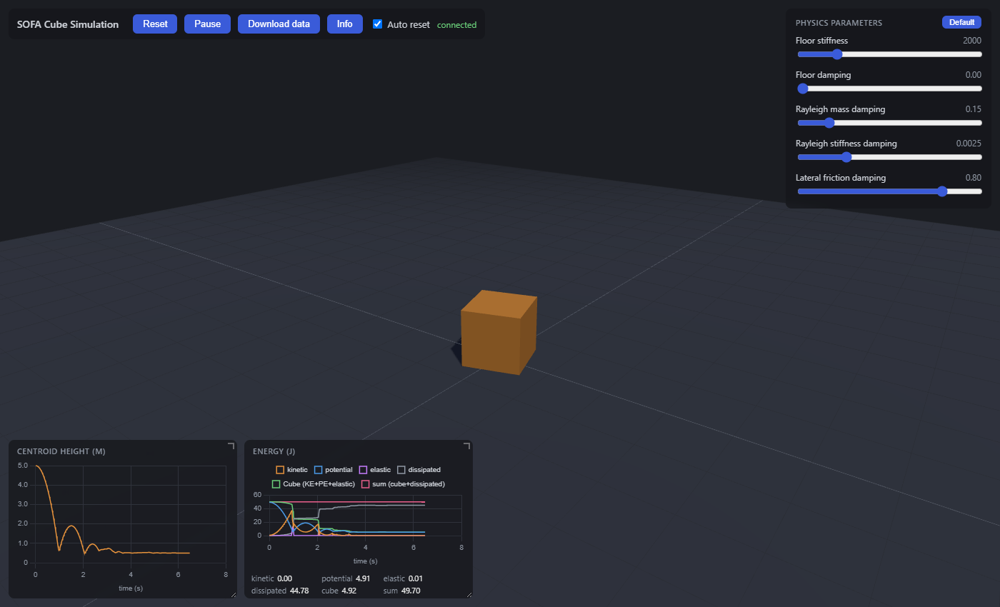

# SOFA_CloSer

## [TestSimInDocker](TestSimInDocker/)

A [SOFA Framework](https://www.sofa-framework.org/) physics demo: a rigid
cube falls under gravity, bounces, and settles on a floor, simulated
headlessly and streamed live to a browser that renders it with three.js and
plots its energy over time. Ships as a single Docker image.



```bash
cd TestSimInDocker
run_docker.bat
```

See [TestSimInDocker/README.md](TestSimInDocker/README.md) for details.

## [MultiSimDocker](MultiSimDocker/)

A multi-user web platform on top of such scenes: visitors claim a simulation
from a limited pool of Docker containers (with a key to reclaim it), watch
anyone else's running simulation read-only, and can hold one for a later
demo; idle simulations return to the pool automatically. Includes a
password-protected admin page.

```bash
cd MultiSimDocker
run.bat
```

See [MultiSimDocker/README.md](MultiSimDocker/README.md) for details.

## AI disclaimer

Claude Code was used to generate the whole simulation and most documentation.
